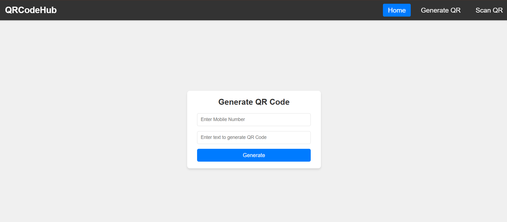
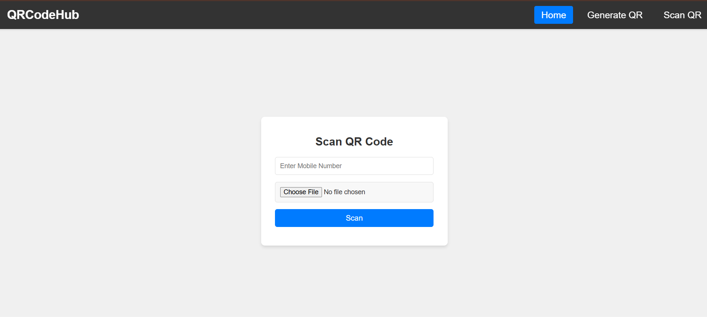
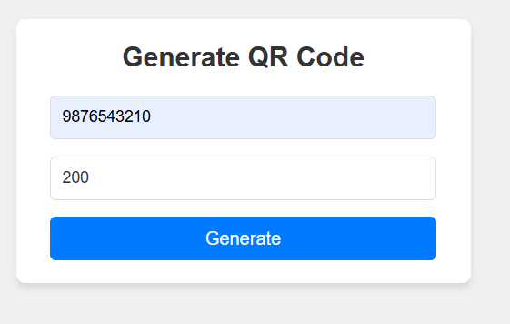
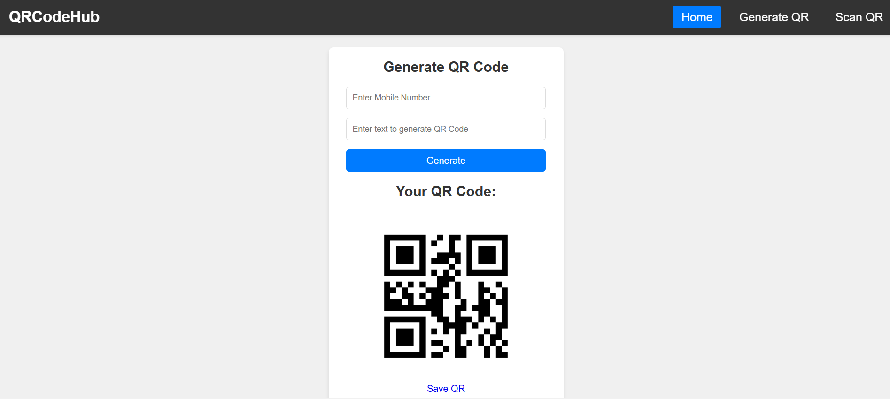

# QR Code Generator and Scanner

This project allows users to generate and scan QR codes associated with mobile numbers. The system provides two main functionalities:

1. **Generate QR Code**: Input a mobile number and data, which will be combined to generate a QR code.
2. **Scan QR Code**: Upload a QR code image, and the system checks if the QR code contains the correct data and mobile number.

## Features
- **Generate QR Code**: Input mobile number and data to generate a QR code.
- **Scan QR Code**: Upload a QR code to validate the mobile number and data stored in the database.
- **File Management**: QR codes are stored and cleaned up after use.
- **Error Handling**: Displays messages for invalid inputs or errors during processing.


## Interface Screenshots

### Home page


### QR Code Generation


### QR Code Scanning



### Demo of QR Code Generation



### Result



### File of Generated QR Code


## Installation

### Prerequisites
- Python 3.x
- Django
- `qrcode` library for QR code generation
- `pyzbar` library for QR code scanning
- `Pillow` library for image processing

### Steps to Install

1. **Clone the repository:**
   Open your terminal and run the following command to clone the repository:
   ```bash
   git clone <repository_url>
   cd <project_directory>
2. **Create a virtual environment:**
   Create a virtual environment to manage dependencies separately for this project.
   ```bash
    python -m venv venv
    venv\Scripts\activate   # For Windows
    source venv/bin/activate  # For Mac/Linux

3. **Install the required dependencies:**
   Install the necessary Python packages listed in requirements.txt.
   ```bash
   pip install -r requirements.txt
   
   If requirements.txt is not available, manually install the required packages:
    
    pip install django
    pip install qrcode
    pip install pyzbar
    pip install pillow

4. **Set up the database:**
Run Django migrations to set up the database.
   ```bash
    python manage.py migrate

5. **Run the Django development server:**
Start the Django server to run the application locally.
    ```bash
    python manage.py runserver

6. **Access the application:**
 Open your browser and go to the following URL to use the app:
     ```bash
     http://127.0.0.1:8000/


**Usage**

***Generate QR Code***
    ```bash
    Navigate to the Generate QR Code page.

    Enter a mobile number (10 digits) and text data.

    Click Generate to create the QR code.

    The QR code will be displayed on the page, and you can download it by clicking the Save QR button.


***Scan QR Code***
    ```bash
      Navigate to the Scan QR Code page.

      Upload a QR code image and provide the mobile number.

      The system will validate the QR code's data and mobile number against the stored records.

      If the QR code is valid, the system will delete the record and image;  otherwise, an error message will be displayed.


### Keywords:
```bash
- QR Code
- Django
- Python
- QR Code Generator
- QR Code Scanner
- Image Processing
- QR Code Validation
- Mobile Number Validation
- Web Application
